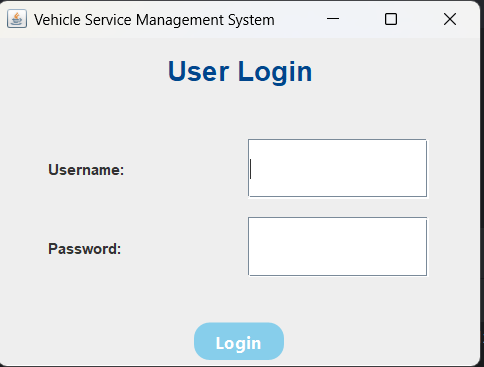
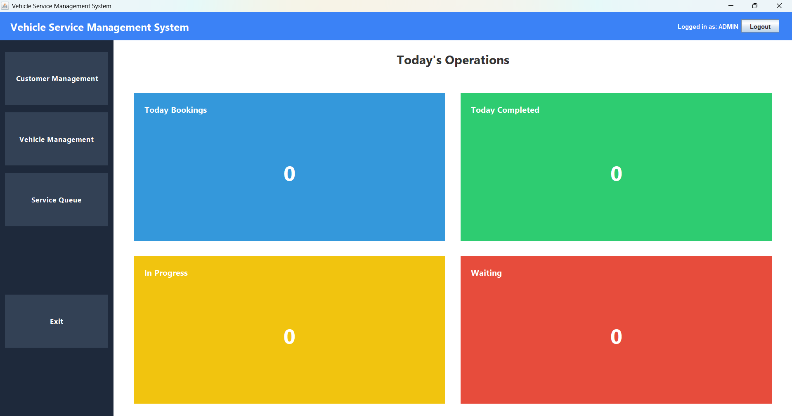
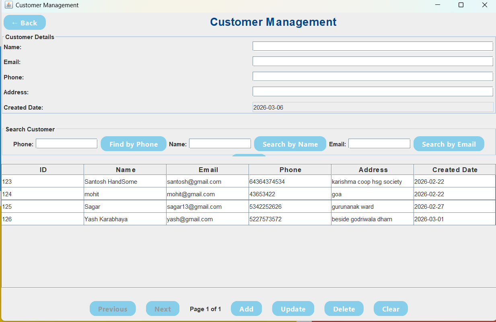
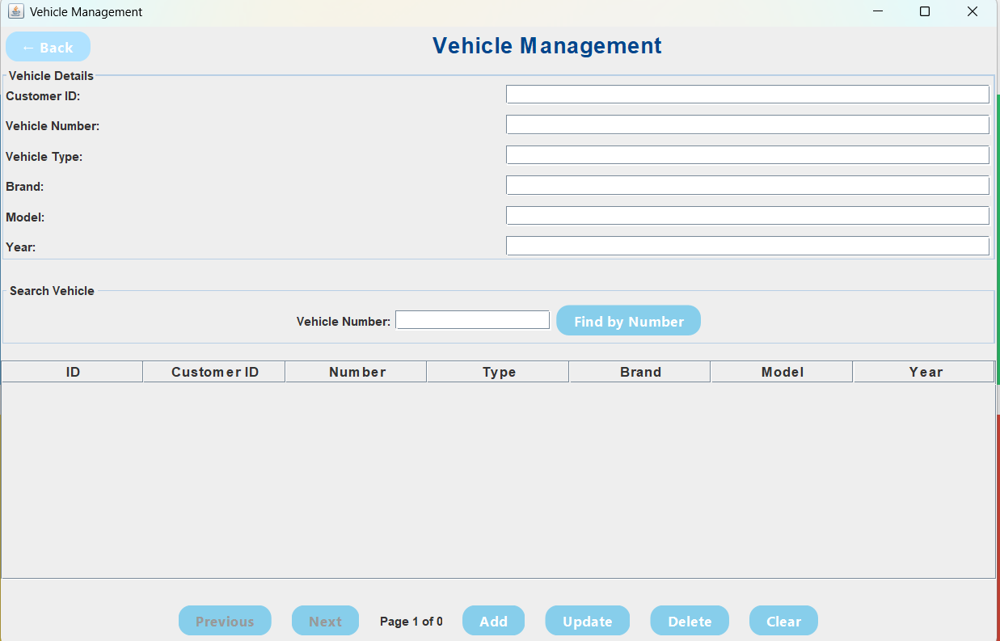
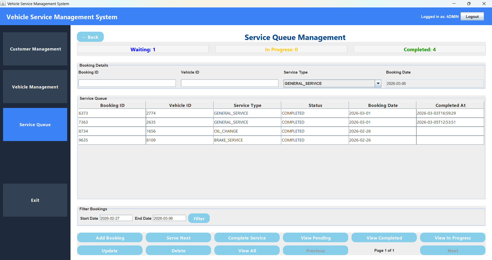

# 🚗 Vehicle Service Management System

A desktop application built in **Java Swing** for managing vehicle service operations in a garage or service center.

The system helps service centers manage customers, vehicles, service bookings, and service queue operations efficiently.

This project follows a **layered architecture (MVC-inspired design)** and demonstrates real-world backend concepts like DAO pattern, service layer, exception handling, and database integration.

---

# 📌 Features

### 🔐 User Authentication
- Secure login system
- Role-based access ready

### 👤 Customer Management
- Add new customers
- Update customer details
- Delete customers
- View customer records

### 🚗 Vehicle Management
- Register vehicles for customers
- Update vehicle details
- Delete vehicles
- Search vehicle by number
- Pagination support

### 🛠 Service Queue Management
- Add service booking
- Serve next vehicle
- Move vehicle to **In Progress**
- Complete service
- Track waiting / in-progress / completed services

### 📊 Dashboard
- Today's bookings
- Today's completed services
- Waiting vehicles
- Vehicles currently in service

### 🎨 Modern UI
- Clean Java Swing UI
- Consistent layout design
- Rounded buttons
- Professional dashboard cards

---

## Application Screenshots

### Login Screen


### Dashboard


### Customer Management


### Vehicle Management


### Service Queue



# 🏗 Project Architecture

The project follows a layered architecture: <br>

UI Layer <br>
↓ <br>
Controller Layer <br>
↓ <br>
Service Layer <br>
↓ <br>
DAO Layer <br>
↓ <br>
Database (MySQL) <br>

Model (Entities)
Used Across All Layers


```
                +-----------------------+
                |       UI Layer        |
                |  (Swing Interfaces)   |
                |     LoginFrame        |
                |  CustomerManagement   |
                |  VehicleManagement    |
                |  ServiceQueuePanel    |
                +----------+------------+
                           |
                           v
                +-----------------------+
                |   Controller Layer    |
                | (Handling UI Requests)|
                |   CustomerController  |
                |   VehicleController   |
                |   UserController      |
                |ServiceQueueController |
                +----------+------------+
                           |
                           v
                +-----------------------+
                |     Service Layer     |
                |   (Business Logic)    |
                |    CustomerService    |
                |     VehicleService    |
                |   ServiceQueueService |
                |     UserService       |
                +----------+------------+
                           |
                           v
                +-----------------------+
                |        DAO Layer      |
                |      CustomerDAO      |
                |       VehicleDAO      |
                |    ServiceBookingDAO  |
                |      ServiceBayDAO    |
                |        UserDAO        |
                +----------+------------+
                           |
                           v
                +-----------------------+
                |       Database        |
                |        MySQL          |
                |      Customers        |
                |      Vehicles         |
                |    ServiceBookings    |
                |     ServiceBays       |
                |       Users           |
                +-----------------------+

                          ↑
                          |
                +------------------+
                |    Model Layer   |
                |    Customer      |
                |    Vehicle       |
                |    User          |
                |   ServiceBooking |
                |   ServiceBay     |
                |   ServiceStatus  |
                |   ServiceType    |
                +------------------+
```


### Folder Structure
src/ <br>
│ <br>
├── app → Application entry point <br>
├── controller → Handles UI requests <br>
├── service → Business logic layer <br>
├── dao → Database operations <br>
├── model → Entity classes <br>
├── ui → Swing UI screens <br>
├── exception → Custom exceptions <br>
├── jdbc → Database connection utility


---

# 🛠 Tech Stack

**Language**  : Java

**UI Framework**  : Java Swing

**Database**  : MySQL

**Database Connectivity**  : JDBC

**IDE** : IntelliJ IDEA

**Version Control**  : Git & GitHub

---

# 🧠 Concepts Implemented

This project demonstrates important backend engineering concepts:

- MVC inspired architecture
- DAO Design Pattern
- Service Layer Architecture
- Exception Handling
- Pagination
- Queue based service management
- JDBC database integration
- Clean UI design with Swing

---

# ⚙️ Setup Instructions

### 1️⃣ Clone Repository
git clone https://github.com/Santosh0710/Vehicle-Service-Management-System.git

### 2️⃣ Open in IDE

Open the project in **IntelliJ IDEA** or any Java IDE.

### 3️⃣ Setup Database

Create MySQL database:  CREATE DATABASE vehicle_service_db;


Update the database credentials in: config.properties file

Example : <br><br> db.url = jdbc:mysql://localhost:3306/vehicle_service_db <br>
          db.username = root <br>
          db.password = your_password


### 4️⃣ Run Application

Run: app/Main.java


---

# 🚀 Future Improvements in Private Version of this Project.

- Spare Parts Inventory Management
- Billing & Invoice System
- Role Based Access (Admin / Staff)
- Service History Reports
- Email / SMS Notification
- REST API version of system
- Web based version

---

# 👨‍💻 Author

**Santosh Thadhani**

GitHub:
https://github.com/Santosh0710

---

⭐ <B> If you like this project, consider giving it a star! </B>

